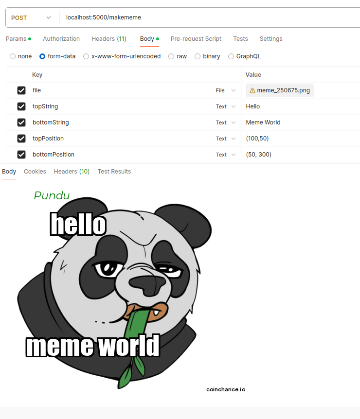

# RandomMemeGenerator
An asynchronous service that retrieves memes from various subreddits on Reddit, providing users with a random selection of entertaining images.

## Requirements

- Python 3.12.2
- Maximum 5 Calls in 1 minutes controlled by RATE_LIMIT and RATE_LIMIT_DURATION variables in .env file

## Local Deployment

### Setup

1. Create a virtual environment:

    ```bash
    python -m venv .venv
    source .venv/bin/activate
    ```

2. Install dependencies:

    ```bash
    pip install -r requirements.txt
    ```

### Run the Application
```bash
    python app.py  
```


### Endpoints
The application exposes following endpoints.

1. Random Memes

- Endpoint: http://127.0.0.1:5000/meme
- Parameter: NONE
- Type: GET

For example, you can try the following link in your browser:

http://127.0.0.1:5000/meme

* Refresh to update the meme in the browser.


2. Memes based on Specific Topics

- Endpoint: http://127.0.0.1:5000/meme/<topic>
- Parameter: NONE
- Type: GET

For example, you can try the following link in your browser:

http://127.0.0.1:5000/meme/crypto

  Memes from following topics are supported. 
    "crypto":["crypto",
        "solana",
        "ethereum",
        "crytpocurrencies",
        "bitcoin",
        "dogecoin",
        "shiba",
        "doge",
        "shibainu",
        "czbinance",
    ]
    "random": ["memes", "meme", "coding", "crypto", "blockchain"],
    "memes": ["memes"],
    "coding": [
        "programmerhumor",
        "programmingmemes",
        "programminghumor",
        "codingmemes",
        "pythonmemes",
        "javascriptmemes",
    ],


3. Generate Memes Given an image and a text string (optional)

- Endpoint: http://127.0.0.1:5000/makememe/
- Parameter: see picture of postman call below
- Type: POST



## Docker Deployment
You can also deploy RandomMemeGenerator using Docker.

### Build and Run Docker Container

```bash
    docker-compose up --build
```
   
